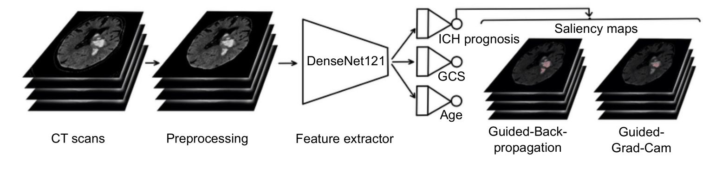
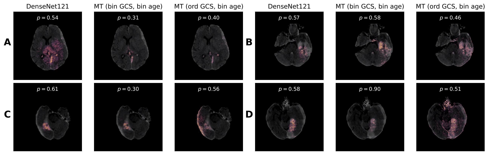

# Multi-task Learning Approach for Intracranial Hemorrhage Prognosis

This repository contains the code of the paper **Multi-task Learning Approach for Intracranial Hemorrhage Prognosis**, accepted at Machine Learning in Medical Imaging workshop @ MICCAI 2024 (MLMI). For our submitted manuscript with added funding acknowledgements and authors' names and affiliations, but without post submission improvements or corrections, please click [here](https://arxiv.org/abs/2408.08784). The final version is now published [here](https://link.springer.com/chapter/10.1007/978-3-031-73290-4_2). The pretrained models are available [here](https://huggingface.co/MiriamCobo/MultitaskLearning_ICH_Prognosis).

In this study, we aim to enhance image-based prognosis by learning a robust feature representation shared between pronosis and the clinical and demographic variables most highly correlated with it. Our approach mimics clinical decision-making by reinforcing the model to learn valuable prognostic data embedded in the image. We propose a 3D multi-task image model to predict prognosis, Glasgow Coma Scale and age, improving accuracy and interpretability, as shown below.

Our method outperforms current state-of-the-art baseline image models, and demonstrates superior performance in ICH prognosis compared to four board-certified neuroradiologists using only CT scans as input.

Contact: Miriam Cobo (cobocano@ifca.unican.es)

### Requirements

To ensure you have all the necessary dependencies and versions required to run this project, please set up a Conda environment using the provided environment.yml file.

### Dataset

All experiments were conducted using the open-source Head-CT 2D/3D images with and without
ICH prepared for Deep Learning dataset. You can ask for access to the dataset at this [link](https://digital.csic.es/handle/10261/275792).

### Training

To launch the training of one of the available multitask image models run the following:

```
python /PATH_TO_REPO/trainImageModels/train_"name_model".py 
```

To launch the training of one of the tabular models run the following:
```
python /PATH_TO_REPO/trainTabularModels/train_"name_model".py 
```

### Citation

If you use this code in your research, please cite our paper:
```
Cobo, Miriam, et al. "Multi-task Learning Approach for Intracranial Hemorrhage Prognosis." International Workshop on Machine Learning in Medical Imaging. Cham: Springer Nature Switzerland, 2024. https://link.springer.com/chapter/10.1007/978-3-031-73290-4_2
```


### Aknowledgments

* Thanks to [Perez et al.](https://digital.csic.es/handle/10261/275792) for the original dataset repository. 
